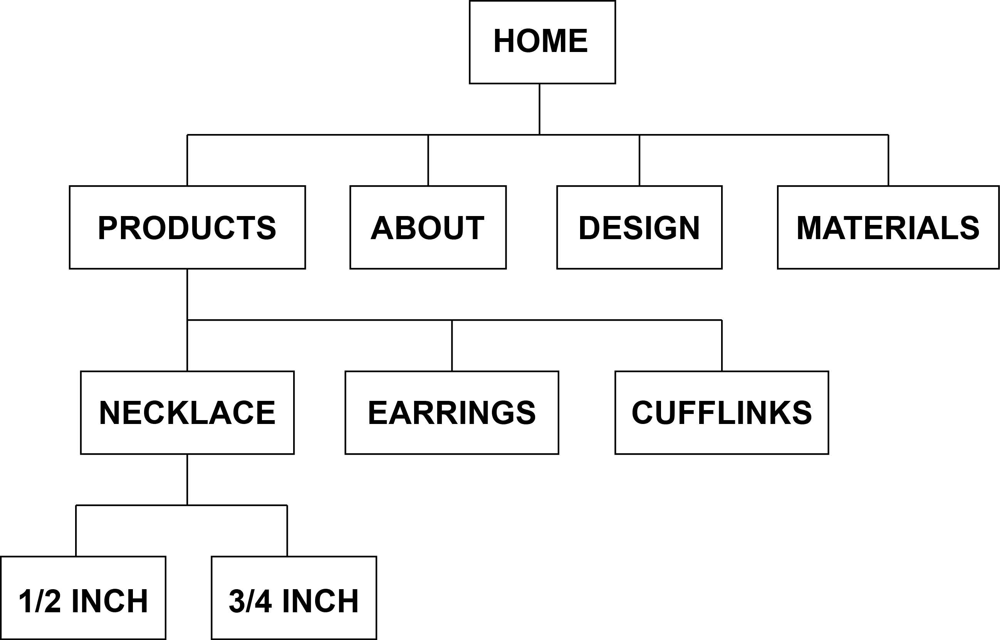

What are the 6 Phases of Web Design?

Information Gathering
Planning
Design
Development
Testing and Delivery
Maintenance

What is your site's primary goal or purpose? What kind of content will your site feature?

My site's goal is to sell jewelry.

What is your target audience's interests and how do you see your site addressing them?

My target audience is interested in technology and architecture. I see my site showcasing the newest images and articles for both.

What is the primary "action" the user should take when coming to your site? Do you want them to search for information, contact you, or see your portfolio? It's ok to have several actions at once, or different actions for different kinds of visitors.

The Primary Action will be entering their initials and viewing their custom necklace.

What are the main things someone should know about design and user experience?

The end-user of the web site must be kept in mind when designing your site. They are the people who will be learning about your service or buying your product. A good user interface creates an easy to navigate web site.

What is user experience design and why is it valuable?

It is how users perceive the site. “Does this website give me value? Is it easy to use? Is it pleasant to use?” User experience design is all about striving to make them answer “Yes” to all of those questions. Designers risk big losses in revenue by neglecting the user experience.

Which parts of the challenge did you find tedious?

Making a new branch, adding the files, confirming them, and merging them to the master. Though, it is still kind of fun to do.