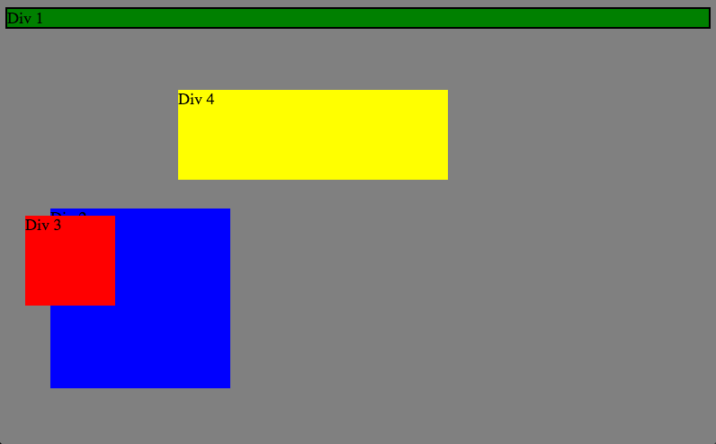
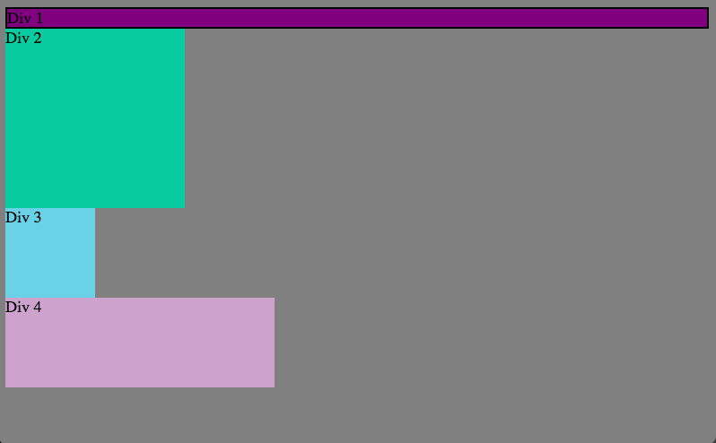
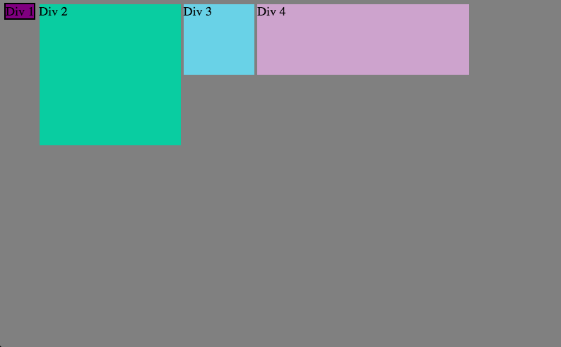
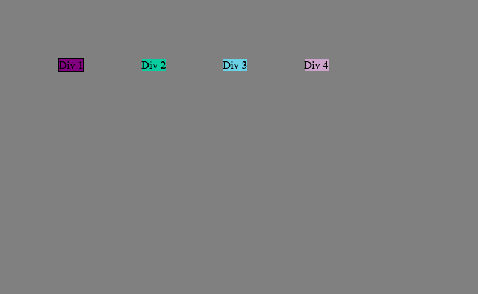
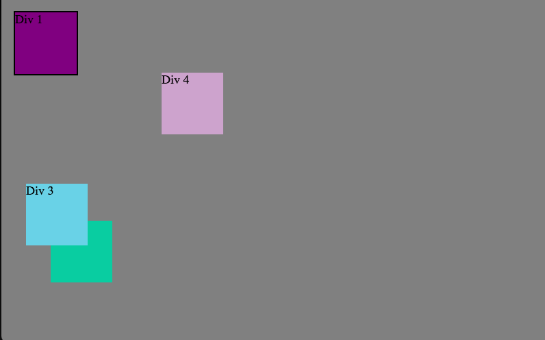
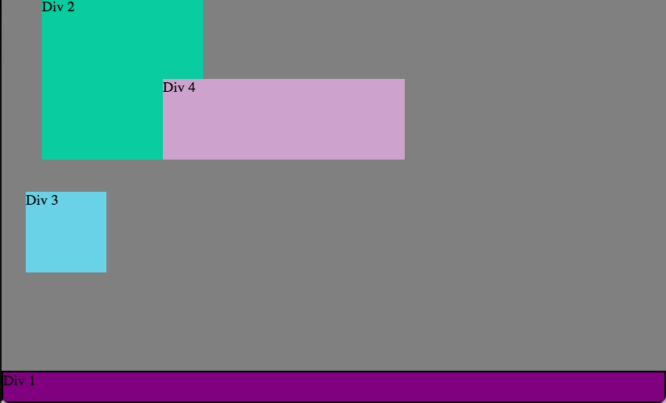
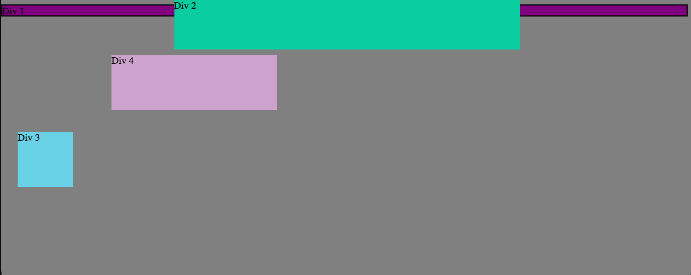
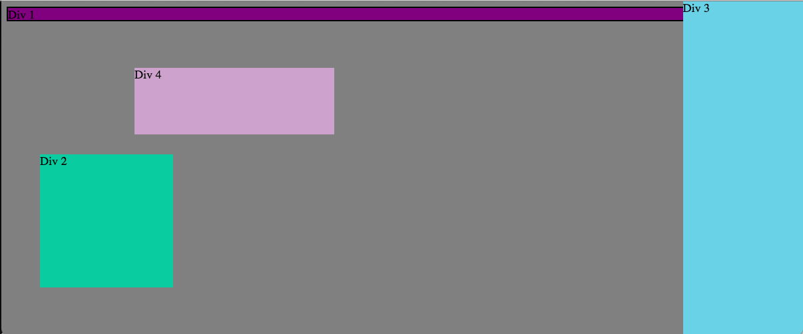
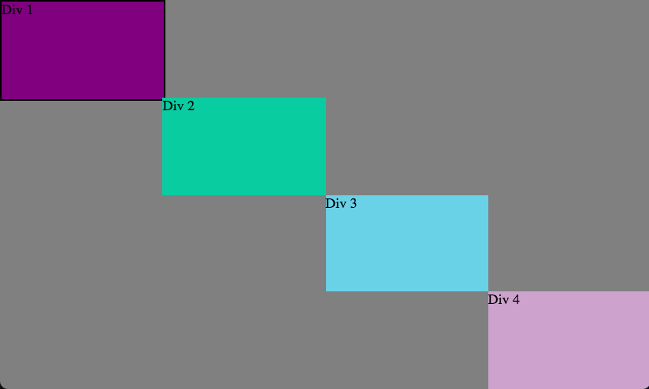

How can you use Chrome's DevTools inspector to help you format or position elements?

You can see the changes you make in chrome's devtools inspector. you can change elements in a very clear way.

How can you resize elements on the DOM using CSS?

you can change their width, height, left, right. they can be units or percentages.

What are the differences between absolute, fixed, static, and relative positioning? Which did you find easiest to use? Which was most difficult?

-static lets the element use the normal behavior, that is it is laid out in its current position in the flow.  The top, right, bottom, left and z-index properties do not apply.
-relative lays out all elements as though the element were not positioned, and then adjust the element's position, without changing layout (and thus leaving a gap for the element where it would have been had it not been positioned). The effect of position:relative on table-*-group, table-row, table-column, table-cell, and table-caption elements is undefined.
-absolute does not leave space for the element. Instead, position it at a specified position relative to its closest positioned ancestor or to the containing block. Absolutely positioned boxes can have margins, they do not collapse with any other margins.
-fixed does not leave space for the element. Instead, position it at a specified position relative to the screen's viewport and don't move it when scrolled. When printing, position it at that fixed position on every page. This value always create a new stacking context.

What are the differences between margin, border, and padding?

Margin clears an area outside the border. The margin is transparent
Border is a border that goes around the padding and content
Padding clears an area around the content. The padding is transparent

What was your impression of this challenge overall? (love, hate, and why?)

Loved it! I love spatial puzzles. I had so much fun.